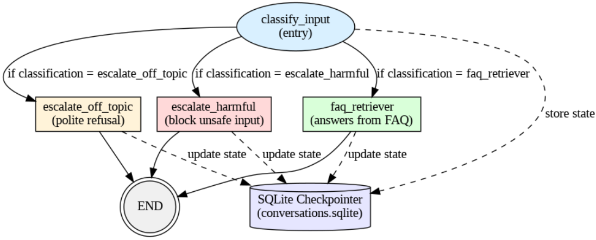

# 🤖 LangGraph Customer Support Assistant

This project is a sophisticated customer support assistant built with LangGraph, LangChain, Groq, and Streamlit. It uses a Retrieval-Augmented Generation (RAG) approach to answer user questions based on a predefined set of FAQs, and includes intelligent routing to handle off-topic or sensitive queries.

## 📊 Workflow Diagram

The core logic of the assistant is a state machine managed by LangGraph. It classifies user input and routes it to the appropriate tool.



## ✨ Features

-   **Intelligent Routing**: Classifies user queries into three categories: standard FAQs, harmful/PII, or off-topic.
-   **RAG for Answering**: Uses a FAISS vector store and HuggingFace embeddings to retrieve relevant context from a knowledge base (`faq_data.py`) to provide accurate answers.
-   **Safety Guardrails**: Provides canned responses for inappropriate or off-topic questions instead of letting the LLM answer them.
-   **Conversation Memory**: Leverages LangGraph's SQLite checkpointer to maintain a history of the conversation for each user session.
-   **Fast Responses**: Powered by the high-speed Groq API with Llama 3.
-   **Interactive UI**: A simple and clean chat interface built with Streamlit.

## 🛠️ Tech Stack

-   **Frameworks**: LangGraph, LangChain, Streamlit
-   **LLM Provider**: Groq (Llama 3)
-   **Vector Store**: FAISS (In-memory)
-   **Embedding Model**: `all-MiniLM-L6-v2` (via HuggingFace)
-   **Database**: SQLite (for conversation state)

---

## 🚀 Setup and Installation

Follow these steps to set up and run the project locally.

**1. Clone the repository:**

```bash
git clone https://github.com/1MaNan071/Customer-Support-Agent.git
