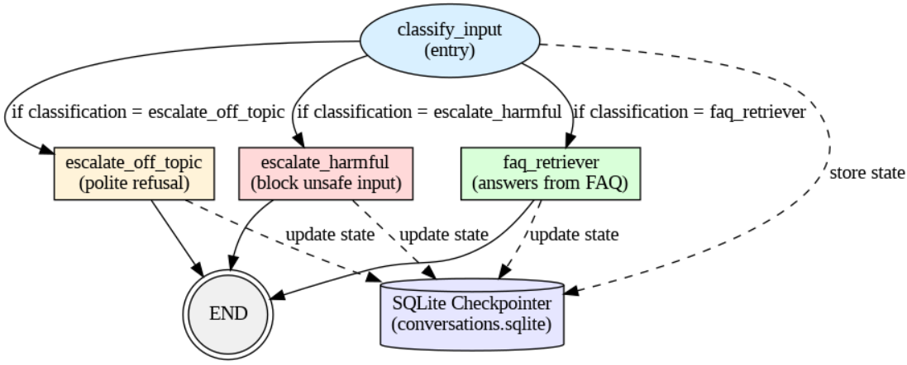

# 🤖 Customer Support Agent

A production-ready AI customer support chatbot that lets companies plug in their own FAQ data and deploy a smart support agent in minutes. Powered by **Groq (Llama 3)**, **FastAPI**, and a clean modern UI — deployable to **Vercel** with one click.



🔗 **Live Demo:** [https://customersupportai.vercel.app/](https://customersupportai.vercel.app/)

---

## ✨ Features

- **Intelligent Query Routing** – Classifies every message as a support question, harmful/PII content, or off-topic, and responds accordingly.
- **RAG-style FAQ Answering** – Injects the full knowledge base into context so the LLM gives accurate, grounded answers.
- **Safety Guardrails** – Blocks sensitive data and off-topic requests with canned safe responses.
- **Data Upload** – Upload your own FAQ data via **JSON**, **CSV**, or **TXT** file through the UI.
- **Live FAQ Management** – Add, delete, or reset FAQs from the sidebar without redeploying.
- **Conversation History** – Client-side history for multi-turn conversations within a session.
- **Vercel-Ready** – Lightweight FastAPI backend deploys as a serverless function; static frontend served from `public/`.

## 🛠️ Tech Stack

| Layer | Technology |
|-------|-----------|
| **LLM** | Groq API (Llama 3.3 70B) |
| **Backend** | FastAPI (Python) |
| **Frontend** | Vanilla HTML / CSS / JS |
| **Hosting** | Vercel (serverless) |

---

## 🗂️ Project Structure

```
Customer-Support-Agent/
├── api/
│   └── index.py          # FastAPI serverless backend
├── public/
│   └── index.html         # Chat UI (single-page app)
├── faq_data.json          # Default FAQ knowledge base
├── vercel.json            # Vercel deployment config
├── requirements.txt       # Python dependencies
├── .env.example           # Environment variable template
├── README.md
│
│  ── Legacy Streamlit app (kept for reference) ──
├── app.py
├── faq_data.py
└── langgraph_logic.py
```

---

## 🚀 Quick Start (Local Development)

### 1. Clone & enter the project

```bash
git clone https://github.com/1MaNan071/Customer-Support-Agent.git
cd Customer-Support-Agent
```

### 2. Create a virtual environment

```bash
python -m venv venv
# Windows
.\venv\Scripts\activate
# macOS / Linux
source venv/bin/activate
```

### 3. Install dependencies

```bash
pip install -r requirements.txt
```

### 4. Set your Groq API key

```bash
cp .env.example .env
# Edit .env and paste your key from https://console.groq.com
```

### 5. Run locally

```bash
uvicorn api.index:app --reload --port 8000
```

Open **http://localhost:8000** in your browser.

---

## ☁️ Deploy to Vercel

### One-click deploy

1. Push the repo to GitHub.
2. Go to [vercel.com/new](https://vercel.com/new) and import the repository.
3. Add the environment variable:
   | Name | Value |
   |------|-------|
   | `GROQ_API_KEY` | `gsk_…` |
4. Click **Deploy**. Done!

### CLI deploy

```bash
npm i -g vercel
vercel login
vercel --prod
# When prompted, add GROQ_API_KEY as an environment variable.
```

---

## 📄 FAQ Data Formats

You can upload your company's FAQ data in three formats:

### JSON
```json
[
  { "question": "How do I reset my password?", "answer": "Go to Settings → Security → Reset Password." },
  { "question": "What are your hours?", "answer": "We are open Mon–Fri, 9 AM – 6 PM EST." }
]
```

### CSV
```csv
question,answer
"How do I reset my password?","Go to Settings → Security → Reset Password."
"What are your hours?","We are open Mon–Fri, 9 AM – 6 PM EST."
```

### TXT
```
Q: How do I reset my password?
A: Go to Settings → Security → Reset Password.

Q: What are your hours?
A: We are open Mon–Fri, 9 AM – 6 PM EST.
```

---

## 🔧 Configuration

| Environment Variable | Default | Description |
|---------------------|---------|-------------|
| `GROQ_API_KEY` | *(required)* | Your Groq API key |
| `GROQ_MODEL` | `llama-3.3-70b-versatile` | Groq model to use |

---

## 📡 API Reference

| Method | Endpoint | Description |
|--------|----------|-------------|
| `POST` | `/api/chat` | Send a message and get a response |
| `GET` | `/api/faqs` | List all loaded FAQs |
| `POST` | `/api/faqs` | Add FAQs programmatically (JSON body) |
| `DELETE` | `/api/faqs/{index}` | Delete a single FAQ |
| `DELETE` | `/api/faqs` | Clear all FAQs |
| `POST` | `/api/faqs/reset` | Reset to default FAQs from file |
| `POST` | `/api/upload` | Upload a .json/.csv/.txt FAQ file |
| `GET` | `/api/health` | Health check |

---

## 📝 License

MIT
